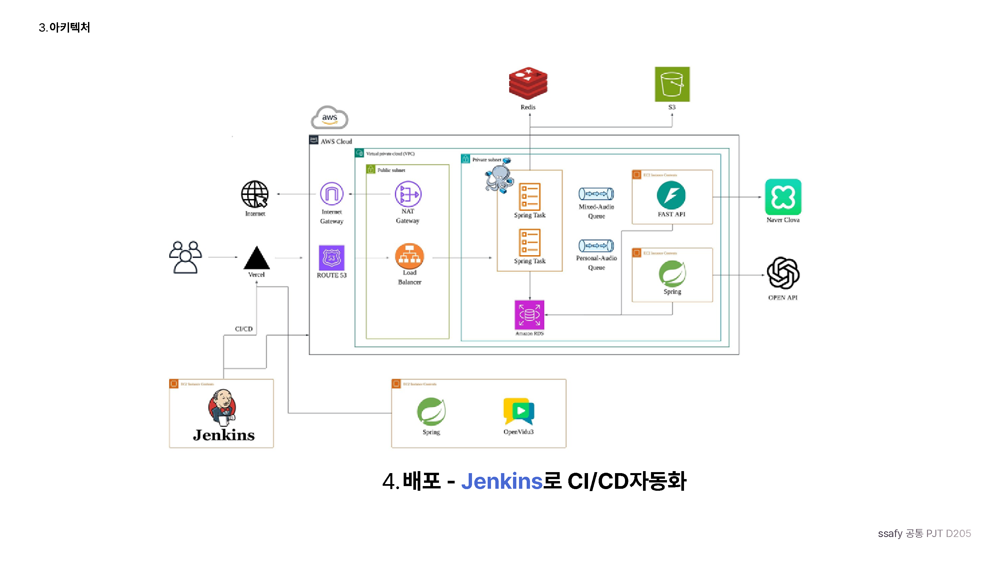

# 🌳 Projectree — 회의를 AI로 지식화하는 프로젝트 협업 플랫폼

> 회의를 AI로 지식화하고, 프로젝트의 의사결정 흐름을 노드로 연결합니다.

화상 회의를 녹음하면 AI가 자동으로 회의록을 만들고, 회의에서 나온 결정·작업·이슈를 **3D 트리 그래프**로 시각화해 프로젝트 전체의 의사결정 흐름을 한눈에 볼 수 있게 해주는 서비스입니다.

SSAFY 15기 공통 프로젝트 D205 팀이 만들었습니다.

---

## 📌 기획 배경

- 회의 내용은 Notion, JIRA, 메신저 등 여러 곳에 흩어져 "그 작업 어디 있죠?" 라는 질문이 반복됩니다.
- 회의가 끝나면 왜 그렇게 결정했는지에 대한 맥락(의사결정 흐름)이 함께 사라집니다.
- McKinsey 조사에 따르면 직장인은 근무 시간의 20%(2012) → 54%(2025)를 정보 검색에 쓰고, Stack Overflow 조사에 따르면 개발자의 상당수가 6개 이상의 협업 도구를 사용합니다.
- **회의가 문제가 아니라, 기록이 문제다.** Projectree는 녹음된 회의를 AI로 분석해 회의록과 의사결정 그래프를 자동으로 생성해 이 문제를 해결합니다.

## 🚀 주요 기능

- **실시간 녹음 화상 회의** — OpenVidu(LiveKit) 기반 화상 회의를 진행하며 음성을 녹음합니다.
- **회의 분석 기반 회의록 생성** — 녹음된 음성을 STT로 텍스트화하고 LLM으로 요약해 회의 요약 · 결정 사항 · 다음 할 일 · 논의 이슈를 자동 생성합니다.
- **회의 분석 기반 프로젝트 시각화** — 회의에서 추출한 결정/작업/이슈를 노드로 만들어 three.js 기반 3D 트리 그래프로 프로젝트 구조를 시각화합니다.
- **개인별 회의 피드백** — 화자 분리를 통해 참석자별 발화를 분석하고 개인별 피드백을 제공합니다.
- **프로젝트/팀원 관리** — 프로젝트 생성, 팀원 초대(이메일), 프로젝트별 회의·노드·팀원 관리를 지원합니다.
- **소셜 로그인** — Google / Naver OAuth 로그인을 지원합니다.

## 🛠️ 기술 스택

### Frontend (`Frontend/`)
- React 19 + TypeScript, Vite 8
- React Router DOM, Zustand (상태 관리)
- three.js / React Three Fiber / drei — 3D 노드 그래프 렌더링
- livekit-client — 화상 회의(WebRTC)
- 배포: Vercel

### Backend (`Backend/`)
- Java 21, Spring Boot 4.1.0 (Spring MVC, Spring Data JPA, QueryDSL)
- MySQL 8.0, Redis(Upstash, 세션 저장소)
- Spring Session, Google/Naver OAuth2 로그인
- AWS SDK(SQS, S3), Spring Cloud AWS
- springdoc-openapi(Swagger)
- 배포: AWS ECS Fargate

### data-pipeline (`data-pipeline/`)
- Python 3.11, FastAPI + Uvicorn
- SQLAlchemy + Alembic, PostgreSQL(pgvector)
- Naver Clova Speech(STT), OpenAI 호환 GMS Client(LLM)
- AWS SDK(boto3) — S3, SQS 기반 비동기 파이프라인
- 배포: EC2 (Worker/Coordinator/Outbox Publisher)

### personal-audio-backend (`personal-audio-backend/`)
- Java 21, Spring Boot 4.1.0
- MySQL, AWS SQS/S3, ffmpeg(음성 처리)
- OpenAI 호환 GMS Client — 개인별 회의 피드백 생성
- 배포: EC2

### Infra / CI-CD
- AWS: Route 53, ALB, VPC(Public/Private Subnet), ECS Fargate, EC2, RDS(MySQL + PostgreSQL), S3, SQS
- Upstash Redis, Jenkins(CI/CD → ECR → ECS), Vercel(Frontend 배포)

## 🏗️ 시스템 아키텍처



1. **요청** — Vercel(Frontend) → Route 53 → ALB(로드밸런서) → ECS Fargate 위 Backend(Spring) 2 Task로 이중화 처리, MySQL(RDS)·Redis(Upstash) 사용
2. **화상 회의** — OpenVidu 3를 별도 EC2로 분리해 WebRTC 화상 회의/녹음을 처리
3. **파이프라인** — 녹음 오디오를 Mixed-Audio Queue / Personal-Audio Queue(SQS) 두 개로 나눠 비동기 처리
   - Mixed-Audio Queue → EC2 FastAPI Worker(`data-pipeline`) → Naver Clova STT → LLM 분석 → 회의록·노드 그래프 생성
   - Personal-Audio Queue → EC2 Spring AI Worker(`personal-audio-backend`) → OpenAI 호환 API → 개인별 피드백 생성
4. **배포** — Jenkins가 GitLab Push를 받아 Backend는 Gradle 빌드 → Docker 이미지 → ECR → ECS Fargate 배포, Frontend는 Vercel로 배포

## 📦 폴더 구조

```text
S15P11D205/
├─ Backend/                 # Spring Boot API 서버 (회원/프로젝트/회의/노드 도메인)
│  └─ src/main/java/com/ssafy/projectree/domain/
│     ├─ member/ project/ meeting/ meetingreview/ nodeCategory/ notification/ mail/ uploadfile/
├─ Frontend/                # React + Vite SPA
│  └─ src/page/             # Auth/ Home/ Landing/ MyPage/ Project(Create/Home/Meeting/Tree/Member/...)
├─ data-pipeline/            # Python FastAPI 기반 회의 분석·노드 생성 파이프라인
│  └─ data_pipeline/         # api/ meeting_analysis/ stt/ llm/ storage/ worker/ outbox_publisher/ ...
├─ personal-audio-backend/  # 개인별 회의 피드백 생성 Spring Boot 서버
│  └─ src/main/java/ssafy/personal_audio_backend/domain/review/
└─ exec/                     # 포팅 매뉴얼 등 실행/배포 산출물
```

## ⚙️ 로컬 실행 방법

### Backend
```bash
cd Backend
cp .env.example .env   # 값 채우기
docker compose up -d   # MySQL 등 로컬 의존성
./gradlew bootRun
```

### personal-audio-backend
```bash
cd personal-audio-backend
cp .env.example .env
docker compose up -d
./gradlew bootRun
```

### data-pipeline
```bash
cd data-pipeline
python -m venv .venv
.venv\Scripts\python.exe -m pip install -e ".[dev]"
docker compose up -d            # PostgreSQL(pgvector)
.venv\Scripts\python.exe -m alembic upgrade head
.venv\Scripts\python.exe -m data_pipeline.meeting_analysis recording-ready-consumer
.venv\Scripts\python.exe -m data_pipeline.meeting_analysis analysis-command-consumer
.venv\Scripts\python.exe -m data_pipeline.meeting_analysis coordinator
.venv\Scripts\python.exe -m data_pipeline.outbox_publisher
```

### Frontend
```bash
cd Frontend
vercel link
vercel env pull .env.local
docker compose up -d   # http://localhost:5173
```

각 모듈에 필요한 환경 변수는 모듈별 `.env.example`과 `exec/Projectree_포팅매뉴얼.pdf`를 참고하세요.

## 📄 문서 / 트러블슈팅

- [Backend API 계약 문서](Backend/docs/api)
- [Backend DB 마이그레이션](Backend/docs/migrations)
- [프로젝트 그래프 연산 가드](Backend/docs/project-graph-operation-guard.md)
- [노드 콘텐츠 수정 SQS 계약](Backend/docs/node-content-update-sqs-contract.md)
- [data-pipeline 자동 그래프 생성 개요](data-pipeline/docs/architecture/automatic-graph-overview.md)
- [data-pipeline 노드 자동 병합 계약](data-pipeline/docs/AUTOMATIC_NODE_MERGE_CONTRACT.md)
- [포팅 매뉴얼](exec/Projectree_포팅매뉴얼.pdf)
- [메시징 큐 적용](docs/troubleshooting/messaging-queue.md)

주요 트러블슈팅 하이라이트:
- **트리 노드 라벨 렌더링 성능**: 노드 수만큼 DOM 라벨이 늘어나 1,000개 기준 평균 9.3 FPS까지 저하 → 표시할 라벨을 고정하고 리렌더를 제거해 라벨 DOM -85%, 평균 45.4 FPS(4.9배), JS 힙 -66% 개선
- **트리 노드 저장 구조**: 최단 경로 탐색에는 Neo4j가 유리하지만 팀 상황을 고려해 RDB + JSON 구조를 선택
- **[노드 생성 요청 유실 → 메시징 큐 적용](docs/troubleshooting/messaging-queue.md)**: HTTP + `@Async` 콜백 구조에서 서버 종료 시 요청이 애플리케이션 메모리와 함께 유실되는 문제 → AWS SQS + DLQ 기반 비동기 큐로 전환해 요청을 서버 외부에 영속시키고, 3회 이상 실패한 작업은 DLQ로 격리해 해결

## 👥 팀 소개

SSAFY 15기 공통 프로젝트 D205

| 이름 | 역할 |
| --- | --- |
| 조희제 | Backend |
| 김경현 | |
| 안현석 | |
| 이상민 | |
| 이종원 | |
| 정서영 | |

> 나머지 팀원 역할은 추후 업데이트 예정입니다.
